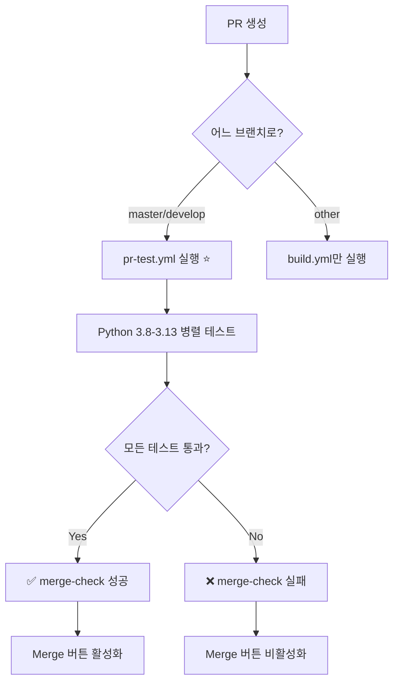

# GitHub Actions & Workflows

이 디렉토리는 PyMODI Plus 프로젝트의 GitHub Actions workflow 설정을 포함하고 있습니다.

## 📂 파일 구조

```
.github/
├── workflows/
│   ├── build.yml              # 빌드 & 테스트 (모든 push/PR)
│   ├── pr-test.yml           # PR 필수 테스트 ⭐
│   ├── unit_test_ubuntu.yml  # Ubuntu 테스트
│   ├── unit_test_macos.yml   # macOS 테스트
│   ├── unit_test_windows.yml # Windows 테스트
│   ├── deploy.yml            # PyPI 배포
│   └── notify.yml            # 알림
├── BRANCH_PROTECTION_GUIDE.md # Branch Protection 설정 가이드
├── WORKFLOW_CHANGES.md        # Workflow 변경사항 상세
└── README.md                  # 이 파일
```

## 🚀 주요 Workflows

### 1. PR Test - Required for Merge ⭐ (pr-test.yml)
**가장 중요한 workflow** - PR 머지 전 필수 테스트

- **트리거**: `master`, `develop`로의 PR
- **Python 버전**: 3.8, 3.9, 3.10, 3.11, 3.12, 3.13
- **실행 내용**:
  - ✅ 코드 스타일 검사 (flake8)
  - ✅ 모든 테스트 실행 (unittest + pytest)
  - ✅ 테스트 커버리지 확인 (Python 3.11)
  - ✅ **merge-check**: 모든 테스트 통과 확인

**핵심 기능**: 
```yaml
merge-check:
  name: ✅ All Tests Must Pass to Merge
  needs: test  # test job이 성공해야만 실행
```
→ 이것을 Branch Protection Rule의 필수 체크로 설정!

### 2. Build Status (build.yml)
모든 브랜치의 push와 PR에서 실행

- **트리거**: 모든 push, `master`/`develop`로의 PR
- **Python 버전**: 3.8-3.13
- **실행 내용**:
  - 코드 스타일 검사
  - unittest 실행
  - pytest 실행

### 3. Unit Test - OS별
Ubuntu, macOS, Windows에서 각각 테스트

- **트리거**: 모든 push, PR
- **Python 버전**: 3.8-3.13
- **실행 내용**:
  - unittest 실행
  - pytest 실행

## 🔒 Branch Protection 설정

PR이 `master` 또는 `develop`에 머지되기 전에 모든 테스트가 통과해야 하도록 설정:

### 빠른 시작
1. GitHub Settings → Branches → Add rule
2. Branch name pattern: `master` (또는 `develop`)
3. 다음 체크:
   - ☑️ Require status checks to pass before merging
   - Required checks:
     - **✅ All Tests Must Pass to Merge** (필수!)
     - Build and Test
4. Create 클릭

### 자세한 설정 방법
👉 **[BRANCH_PROTECTION_GUIDE.md](BRANCH_PROTECTION_GUIDE.md)** 참조

## 📊 테스트 커버리지

| 항목 | 상태 |
|------|------|
| Python 버전 | 3.8 ~ 3.13 (6개 버전) |
| OS | Ubuntu, macOS, Windows |
| 테스트 프레임워크 | unittest + pytest |
| 코드 스타일 | flake8 |
| 커버리지 리포트 | pytest-cov |

## 🧪 로컬에서 테스트

PR 생성 전에 로컬에서 동일한 테스트 실행:

```bash
# 전체 테스트 (GitHub Actions와 동일)
make test

# 코드 스타일 검사
make lint

# 특정 모듈만 테스트
make test-input    # input 모듈만
make test-output   # output 모듈만
make test-task     # task 모듈만

# 테스트 커버리지
make coverage

# 모든 자동화 테스트
make test-all
```

## 🔄 Workflow 실행 흐름



## 📝 최근 변경사항

**2025-11-19 업데이트**:
- ✨ Python 3.12, 3.13 지원 추가
- ✨ PR 머지 전 필수 테스트 강제화
- ⬆️ GitHub Actions 버전 업그레이드 (v4, v5)
- 🔧 pytest 테스트 추가 (make test와 동등)
- 📚 Branch Protection 가이드 추가

상세 내용: [WORKFLOW_CHANGES.md](WORKFLOW_CHANGES.md)

## 🛠️ 문제 해결

### Status Checks가 보이지 않음
**해결**: 먼저 PR을 하나 생성하여 workflow가 실행되게 한 후, Branch Protection Rule 설정

### 테스트가 로컬에서는 통과하는데 GitHub에서 실패
**확인 사항**:
- Python 버전 차이
- 의존성 버전 (`requirements.txt`)
- 환경 변수 차이

**해결**:
```bash
# 로컬에서 동일하게 테스트
python -m pytest tests/task/ tests/module/input_module/ tests/module/output_module/ -v
```

### Workflow 권한 오류
**해결**: Settings → Actions → General → Workflow permissions → "Read and write permissions" 확인

## 📚 참고 자료

- [GitHub Actions 공식 문서](https://docs.github.com/en/actions)
- [Branch Protection 공식 문서](https://docs.github.com/en/repositories/configuring-branches-and-merges-in-your-repository/managing-protected-branches)
- [pytest 공식 문서](https://docs.pytest.org/)
- [프로젝트 Makefile](../Makefile) - `make help` 명령 참조

## 💡 Best Practices

1. ✅ **PR 생성 전**: 로컬에서 `make test` 실행
2. ✅ **코드 작성 후**: `make lint`로 스타일 확인
3. ✅ **커밋 전**: 관련 테스트가 통과하는지 확인
4. ✅ **PR 생성 후**: Actions 탭에서 진행 상황 모니터링
5. ✅ **테스트 실패 시**: 로그를 확인하고 로컬에서 재현

## 🤝 기여하기

Workflow 수정이 필요한 경우:
1. `.github/workflows/` 디렉토리의 YAML 파일 수정
2. 로컬에서 YAML 문법 검증
3. 테스트 PR 생성하여 동작 확인
4. 문서 업데이트 (`WORKFLOW_CHANGES.md`)

---

**문의**: 문제가 발생하면 프로젝트 관리자에게 문의하세요.

